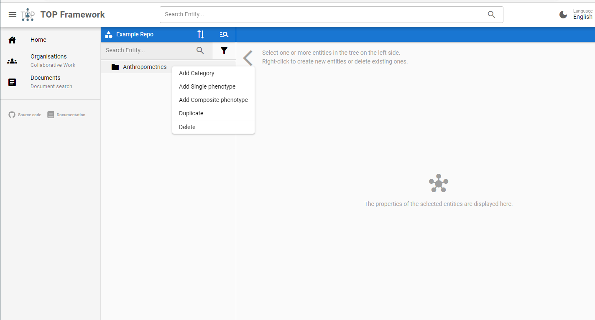
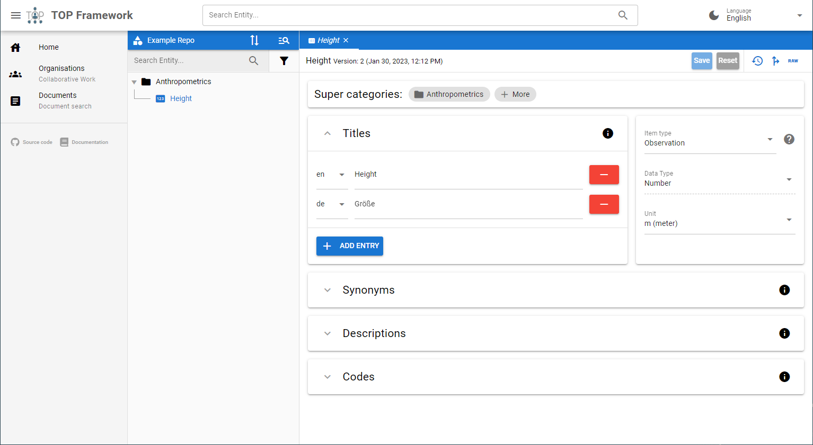
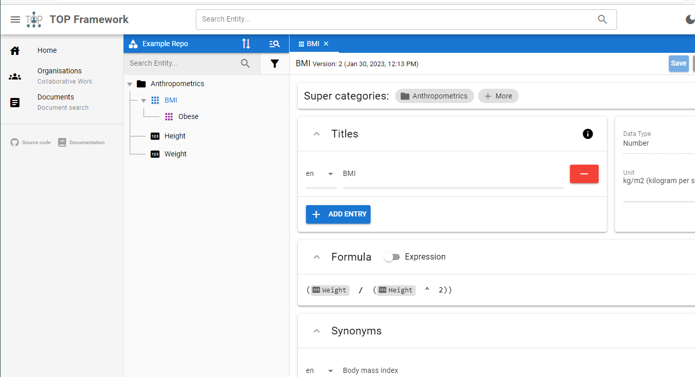

# Manipulate Entities
{: .no_toc }

## Table of contents
{: .no_toc .text-delta }

1. TOC
{:toc}

## Create
In order to create new entities (phenotypes or categories) you have to navigate to a repository, where new entities shall be stored in.

On the left side of the screen you will see the tree view where all available entities of the repository are listed. If the repository is empty, the list is blank.

You can create new entities by right clicking anywhere in the tree. If you clicked on an empty space the new entity will be placed on root level. And if you clicked on a node, the new entity will be placed below this node.

A right click will always open a context menu with one ore more options, depending in the item you clicked on. In the example below a right click was performed on the category "Anthropometrics", thus displayed options to create abstract phenotypes, as well as to delete the category it self.

_Figure 1: Context menu to create a new entity._

After selecting on of the proposed options, a new tab will open on the right side of the editor. Fill out the fields and provide describing metadata where applicable. When you are satisfied, click on the "Save" button to persist the entered data.

## Update
To update existing entities, just left click on the desired entity in the tree on the left side. A tab with the selected entity will be displayed on the right side. You can now modify the field values and click on "Save" to submit the modifications.

_Figure 2: A single phenotype that can be modified and updated by clicking "Save"._

## Delete
As shown in figure 1, the context menu of entities in the tree on the left site contains an option to delete the selected entity. The context menu can be opened via right click. Depending on type of the entity that will be deleted, additional entities will be affected by the delete operation.

If the entity C is a category, all in C contained entities will be "moved up" in the tree (i.e., the super category of C will become the super category of entities contained in C).

If the entity is an abstract phenotype, all restrictions on that entity will be deleted too.

## Expression editor
The Phenotype Editor has a special component to build boolean and mathematical expressions (see figure 3). You can left click parts of an expression (i.e., entities, constants and operators) to open a small context menu. In this menu you can change the type of the part and remove or surround it with another operator. In case of entities, the context menu allows you to navigate to the definition of that entity.

Entities are added by selecting "Entity" as expression part. You can then enter the name or synonym of the desired entity.

_Figure 3: A derived phenotype where the mathematical formula was built with the expression editor component._
