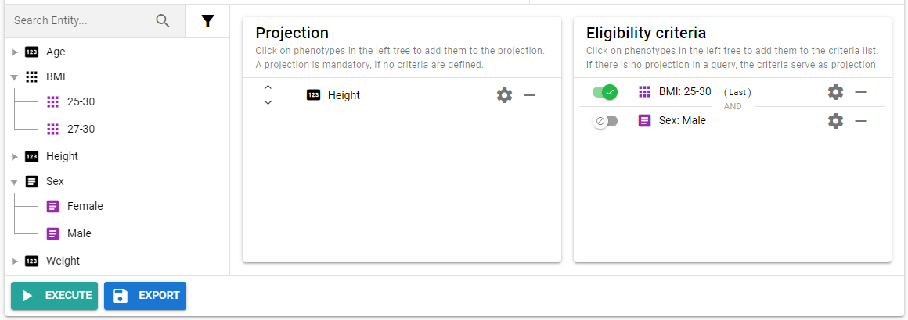

# Query Builder
{: .no_toc }

Build and perform phenotypic queries.
{: .fs-6 .fw-300 }

The Query Builder enables users to construct phenotypic queries with phenotypes of a repository.
Queries can be executed against one or more data sources to get result sets with matching subjects (i.e., patients and study participants).

## Table of contents
{: .no_toc .text-delta }

1. TOC
{:toc}

## Access the Query Builder
In order to access the query builder and start building your query, you first have to navigate to the repository from which you want to build the query.

Click on the button above the entity tree on the left side as shown in figure 1.

_Figure 1: Press the top right button to open the query builder._

## Build a Query
The query building is divided in multiple sections, which will be described here. All mandatory configurations are marked with red exclamation marks.

### General Configuration
In the first section you can define a name for the query and select one or more data sources, on which you want to perform the query.

There is also an option to import a previously exported query setup.

_Figure 2: General configuration of a query._

### Projection and Eligibility Criteria

* **Projection:** list of phenotypes to be included in the result set
* **Eligibility criteria:** list of phenotypes to be applied as in or exclusion criteria (only phenotypes with Boolean data type and restricted phenotypes are allowed)

Left click on phenotypes in the tree on the left side to add them as projection and eligibility criteria to your query.
You can also perform a right click on phenotypes in the tree to specify whether they should be added to the projection or criteria list.
If you want to convert a criterion to an exclusion criterion, you can use the sliders in front of each criteria. In the example in figure 3,
the phenotype "Sex: Male" has been marked as exclusion criterion. You can remove projections and criteria by clicking the minus button behind each entry.

_Figure 3: A simple query with projection and criteria. "Sex: Male" is an exclusion criterion._

Advanced queries can be build by specifying time restrictions for criteria. For instance, you can query for subjects with height values in range 2022-05-11 22:33 and
2023-06-19 10:32 (see figure 4). You can also add multiple entries of a phenotype to the projection or criteria list and specify different time ranges for each entry.

_Figure 4: Example restrictions of a criterion._

If your query contains a composite phenotype, you must specify a default aggregation function. This function is used to aggregate multiple phenotype values to one value
and to be able to use it for calculations

## Query Execution and Results
If you have finished the query specification, click "Execute" to enqueue the query. When the execution has finished, the result is shown in the "Previous queries" section.
You can adjust a query and execute it multiple times and there is also an option to download the result set (must be enabled by administrators).

_Figure 5: Previous queries section with buttons to download result sets, reuse a query, and delete a query._
